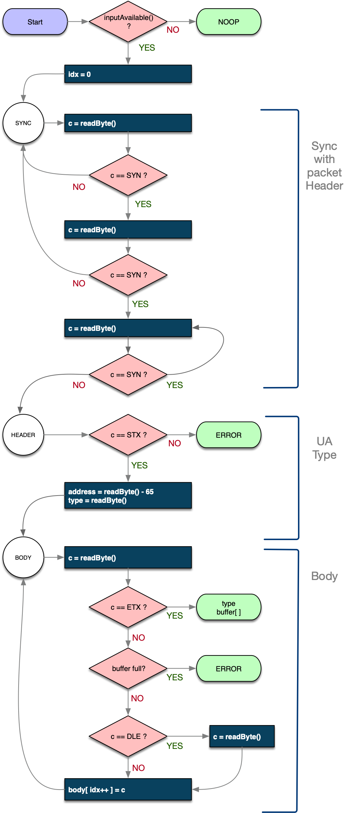

# CMRInet Protocol
HOST and NODE implementation details  
John Plocher, Jan 2020

Derived from the NMRA Layout Control Specification:
  * www.nmra.org ->
Standards & RPs  ->
Other  -> 
lcs-9.10.1_cmrinet_v1.1.pdf

<em>CMRInet Protocol Implementation Details</em>

This document enumerates the format and rules for sending and receiving 
data over a Master/Slave communication link. A Host communicates to 
one or more Node devices using a serial packet protocol comprised of 
8 bit bytes.

## CMRInet Packet Format 
Host software creates packets of information to be transmitted to Nodes 
using a shared party line communications link. Packets consist of 
control characters that mark the beginning and end of transmissions, 
metadata that defines addresses and packet types, as well as payload 
data associated with each packet type.

The CMRInet protocol operates in a polled, serial communication 
network environment. A computer (typically running a control 
program such as JMRI) operates as the Host, with one or more Nodes 
connected by way of a serial RS422/RS485 cabling chain.  Each Node 
on a chain has an assigned unique addresses in the range of 
0 through 127.

Packets are built out of 8-bit binary quantities called bytes. 
There are four types of packets: 
  * Initialization, 
  * Poll Request
  * Receive Data, and 
  * Transmit Data. 
  
Each message packet consists of synchronization, metadata and possibly data bytes. Synchronization separates one packet from another and metadata defines the type of data which needs to be processed. CMRInet serial character framing consists of 10 asynchronous bits; 1 Start bit, 8 Data bits, 1 Stop bit, with no parity, known as “81N”. 
Four control characters are used in framing a packet: 
  * STX (0x02)  start of packet 
  * ETX (0x03)  end of packet 
  * DLE (0x10) data link escape (protects use of STX, ETX and SYN in data payload)
  * SYN (hex 0xFF) packet synchronization character. 
  
A valid CMRInet packet consists of a message header, message body, and message trailer.  Misaddressed or otherwise malformed or invalid packets should be gracefully ignored by robust implementations.


<table border="1">
<tr><th colspan=2> Synchronization </th><th colspan=3> Header </th><th> Body</th><th> Trailer </th></tr>                                          
<tr><td>SYN</td><td>SYN</td><td>STX</td><td>Address</td><td>Type</td><td>DATA</td><td>ETX</td></tr>
</table>

A packet header consists of 
  1. two synchronization bytes (SYN), 
  2. a start-of-text (STX) followed by 
  3. a representation of the Node address: (Node address + 65), 
  5. followed by the message type, which is a single upper case alpha character. 

The message body (data) is 0 to 256 data bytes in length. 
  > A data byte in the message Body can be any binary value, 
0 to 255 decimal. Four of those values are protocol control 
codes, decimal values 2 (STX), 3 (ETX), 16 (DLE) and 255 (0xFF). 
In order to deal with protocol character values in a data stream, 
the data-link-escape character (DLE, decimal 16) is used. 
Protocol management software must insert a DLE in front of 
any of these data values when forming a Transmit Data or 
Receive Data message. The receiver, when seeing a DLE in 
the message body, ignores the DLE and takes the next character 
in the data stream for processing. 
This approach provides for unambiguous transmission of pure 
binary data between Host and Node.

The message trailer is a single end-of-text (ETX) character. 
  > The ETX character signals the end of the message and is 
    used by the software to transition from protocol parsing 
    to message data processing, either in the Host or the Node. 

### Node Address
Node addresses can be any unique number from 0 through 127. 
When transmitted as part of a packet, the address has 65 added 
to it to ensure that this field won’t ever be misidentified 
as a protocol control character, and thus never needs to be 
escaped with a DLE sequence.

### CMRInet Protocol Command Sequence 
The Host establishes a connection with a Node by first sending 
an INIT packet with parameters set by the Host. Parameters in 
the initialization packet are used by the Host and Node to 
negotiate the operating characteristics and parameters of 
the connection.   Robust Node implementations will accept 
multiple INIT packets at any point where a packet can be 
received; they should also have a documented initial state 
that governs their behavior before or in the absence of an 
INIT packet.  In a distributed environment, where Nodes can 
arbitrarily reset, robust Host software might also wish to 
infrequently resend INIT packets.

Once connected, the Host may request input data from 
the Node by issuing a POLL Request. The addressed Node 
responds with a RECEIVE DATA packet containing data bytes 
representing the state of the Node’s input port bits. 
Similarly, if the Host has output data for the Node, 
the Host issues a TRANSMIT DATA packet with data bytes 
representing the output port state bits for the Node.
POLL messages from the Host are followed by a RECEIVE DATA 
response message from the addressed Node, which in the 
half-duplex environment of RS422/RS485 means that the 
master must stop transmitting and listen for the response.
Robust Host implementations will need to handle Node 
response failures.

While every Host session must start with an INIT packet, 
and POLLs are expected to be followed by a RECEIVE DATA, 
there is no required ordering of POLL and TRANSMIT DATA 
messages; a Node should make no assumptions about the 
send and receive order or sequence.  

Both of the following are valid Host implementations:

<table border="1">
<tr><th>Ping Pong</th> <th>As Needed</th></tr>
<tr>
<td>
<pre>
Loop:
    POLL / RECEIVE  
    ... process ...
    TRANSMIT
End Loop
</pre>
</td>
<td>
<pre>
Loop:
    if need_to_read
        POLL / RECEIVE  
    ... process ...
    if data_changed
        TRANSMIT
End Loop
</pre>
</td>
</tr>
</table>

### Mapping between packet bits and I/O space

The logical to physical mapping between TRANSMIT / RECEIVE packet 
body contents and the I/O port/pin spaces is completely up to the 
Node's sketch implementation.

For both RECEIVE and TRANSMIT packets, “Traditional” CMRI devices used byte-aligned port direction assignments.  All 8-bits in a port were the same direction, either ‘I’ or ‘O’, which reflected the I/O hardware limits of their times; newer ‘duino based Nodes are free to intermingle ‘I’ and ‘O’ bits among their physical ports however desired. The implication is that the input and output bits in a packet are “logical bits” - only their order matters, not their byte or word alignment.

For example, if a Node has 8 inputs and 8 outputs, it will send/get an 8-bit byte of data for each RECEIVE or TRANSMIT packet, no matter what the Node’s physical port arrangements might be.  As an illustration, all of the following Node I/O port/pin configurations are valid 8-in, 8-out implementations, it is up to the Node’s sketch to pack and unpack the data bits to align its hardware to the user’s wiring choices.

| Possible packet to <br>I/O space mappings |     |     |     |     |     |     |     |     |     |     |     |     |     |     |     |     |
| ------------------ | --- | --- | --- | --- | --- | --- | --- | --- | --- | --- | --- | --- | --- | --- | --- | --- |
| Byte sized ports   | I | I | I | I | I | I | I | I | O | O | O | O | O | O | O | O
| Byte sized ports   | O | O | O | O | O | O | O | O | I | I | I | I | I | I | I | I
| Mixed Nibbles      | I | I | I | I | O | O | O | O | I | I | I | I | O | O | O | O
| Random             | O | I | I | O | O | I | I | O | O | I | I | O | O | I | I | O
| Random             | O | O | I | I | I | O | I | I | I | I | O | O | O | O | O | I
 

## Packet Structure

### INIT

<table><tbody>
<tr><td colspan="11">Initialization Packet</td></tr>
<tr><td colspan="11">HOST ==&gt; NODE</td></tr>
<tr><td colspan="2">Sync</td><td colspan="3">Header</td><td colspan="5">Body</td><td>Trailer</td></tr>
<tr<td>SYN</td><td>SYN</td><td>STX</td><td>Address</td><td>I</td><td>&lt;NDP&gt;</td><td>   &lt;dH&gt;</td><td>   &lt;dL&gt;</td><td>   &lt;NS&gt;</td><td>   CT[1]-CT[NS]</td><td>ETX</td></tr></tbody></table>

The initialization packet is sent from the Host to the Node, 
specifying a Node definition parameter (NDP) based on its Node type. 
Each Node must receive an initialization packet before sending 
it POLL or TRANSMIT packets.

#### Body: 
##### Node Definition Parameter:

  *  \<NDP\><br><br>
One of:
     * N - Classic USIC using 24-bit cards
     * N - SUSIC using 24 bit input/output cards.
     * X - SUSIC using 32 bit input/output cards.
     * M - SMINI with fixed 24 inputs and 48 outputs
     * C - CPNODE with 8 to 144 input/outputs.

##### Transmission Delay:

  * \<dH\>\<dL\><br><br>
delay\_time = (dH \* 256) + dL; // in 10uS<br>
uS\_delay = delay\_time \* 10; // in uS<br>
dH = (delay\_time / 256);<br>
dL = (delay\_time % 256);<br><br>
Each unit of transmission delay represents 10 microseconds (us) of delay. These two values are usually set to zero for modern Host computers. A non-zero transmission delay value will cause SMINI, SUSIC, USIC and cpNode Nodes to delay that many uS before starting a new transmission to the Host.

##### NS

  * Number of card Sets <br><br>
For Nodes defined as "X" (32-bit SUSIC) or "N" (24-bit USIC or SUSIC), 
NS specifies the number of *\[card sets of four\]* plugged into the 
SUSIC motherboard or implemented on the SUSIC. Valid values are 1..64.<br>
For Nodes defined as "M" (SMINI) NS specifies the number of output bit 
pairs used for creating a Yellow signal aspect by oscillating a 2-lead 
bi-color LED. There are six total output card elements, so the valid 
values for NS are 1..6.<br>
"C" type nodes do not use the CT array, and set NS=0<br>
(If NS is zero, no CT\[ \] bytes are included in the Initialization message.)

##### Card Element Array

  * CT\[1\]...CT\[NS\]

For Nodes defined as "X" or "N", CT(1)\...CT(NS) specifies bytes 
that define input, and output card types and their address locations 
on a motherboard. These bytes are structured as 2-bits per card 
(which is why there are 4-card cardsets...), with the values for each 
pair being:
  * 0=unused, 
  * 1=input, 
  * 2=output and 
  * 3=reserved <br>


### POLL
<table><tbody>
<tr><td colspan="6">POLL Packet</td></tr>
<tr><td colspan="6">HOST ==&gt; NODE</td></tr>
<tr><td colspan="2">Sync</td><td colspan="3">Header</td><td>Trailer</td></tr>
<tr<td>SYN</td><td>SYN</td><td>STX</td><td>Address</td><td>P</td><td>ETX</td></tr></tbody></table>


The Host transmits a Poll Request message to a Node to request input data bytes. 
The Node responds with a Receive Data (RX) message . 
The Host waits for a response from the Node for a specified time, 
known as the timeout interval. If a Receive Data message is not 
received from the addressed Node within the timeout interval, the Host 
software handles the failure as a timeout error.

#### Body: none

The POLL packet has no body. The Header is immediately followed by the ETX trailer.


### RX - RECEIVE
<table><tbody>
<tr><td colspan="9">Receive Data Packet</td></tr>
<tr><td colspan="9">HOST &lt;== NODE</td></tr>
<tr><td colspan="2">Sync</td><td colspan="3">Header</td><td colspan="3">Body</td><td>Trailer</td></tr>
<tr<td>SYN</td><td>SYN</td><td>STX</td><td>Address</td><td>R</td><td>IB[1]</td><td>...</td><td>IB[NI]</td><td>ETX</td></tr></tbody></table>


The Node transmits a Receive Data message in direct response to a 
Poll (P) message from the Host.

The Address in this packet is that of the responding Node, so that 
the Host can determine who sent the response.

#### Body: IB array

The number of bytes sent in the Body, NI, is the total number of bytes 
needed to record the Node's input bits. If the number of node input 
bits is not a multiple of 8, any unused bits in the last byte in the 
IB array must be zero. Data Link Escape (DLE) processing must be applied 
to the message data.


### TX - Transmit

<table><tbody>
<tr><td colspan="9">Transmit Data Packet</td></tr>
<tr><td colspan="9">HOST ==&gt; NODE</td></tr>
<tr><td colspan="2">Sync</td><td colspan="3">Header</td><td colspan="3">Body</td><td>Trailer</td></tr>
<tr<td>SYN</td><td>SYN</td><td>STX</td><td>Address</td><td>R</td><td>OB[1]</td><td>...</td><td>OB[NI]</td><td>ETX</td></tr></tbody></table>


The Host transmits a Transmit Data message to set output card 
output port/pin values.

#### Body: OB array

The number of bytes sent in the Body, NO, is the total number of 
bytes needed to record the Node's output bits. If the number of 
node output bits is not a multiple of 8, any unused bits in the 
last byte in the OB array must be zero. Data Link Escape (DLE) 
processing must be applied to the message data.

## Packet Ingest and Decoding

The following protocol state machine and code examples show 
one approach to parsing an incoming CMRInet packet. This design is 
intended to be called from the Arduino's main loop() routine; it 
returns NOOP if no packet was available, the packet type (I,P,R,T) 
and packet Body, or ERROR. As a design choice, this code does not 
validate Header or Body content, but instead leaves such things up 
to the caller.

The first thing checked is if there is anything to read - if not, 
the parser returns NOOP as a way to make the call slightly asynchronous 
and allow other processing to happen in the sketch if no packet is 
available. If there is something to read, an entire packet is read 
synchronously.

If there is something to read, the sync with the byte stream, looking 
for **two or more** sequential SYN characters, discarding everything 
until satisfied. Because of DLE processing in the Body, we won't false 
trigger on packet Body content.

Once things have synced up, the next three Header bytes are required:

  * STX, 
  * UA, &amp;
  * TYPE

The Header is followed by an optional Body and a final ETX.



Provided by sketch:

  * readByte() return the next byte available on the RS422/485 port
  * inputAvailable() if a byte is available in the serial stream's buffer

Shared with sketch:

  * type: The packet type (I,P,R,T)
  * body\[ \]: The BODY of a packet (content depends on OPCode)
  * address: Addressee info contained in packet header (0..64)

Implementation details:

  * idx: internal: Index into BODY buffer array
  * c: internal: Current byte of protocol being parsed

```
CMRI\_Packet::Type \*getPacket(CMRI\_Packet \*packet) 
    if (\_serial.available() \<= 0) {
        return CMRI\_Packet::NOOP;
    }

    int idx = 0;
    byte c;
    CMRI\_Node::ParseState state = CMRI\_Node::SYNC;
    while (1) {
        switch (state) {
        case CMRI\_Node::SYNC: // Sync with packet byte stream\...
            int loops = 0;
            do {
                c = CMRI\_Node::readByte();
                loops++; // count the SYNs we commit\...
            } while (c == CMRI\_Packet::SYN);
            if (loops \< 3) {
                break; // (we didn\'t see at least two SYNs & STX)
            }
            state = CMRI\_Node::HEADER;
            break;

        case CMRI\_Node::HEADER: // ==== Packet Header ====
            if (c != CMRI\_Packet::STX) { // .. followed by a STX
                return CMRI\_Node::ERROR; // ERROR
            }
            packet-\>address = readByte();
            packet-\>type = readByte();
            state = CMRI\_Node::BODY;
            break;

        case CMRI\_Node::BODY: // ==== Packet Body ====
            c = CMRI\_Node::readByte();
            if (c == CMRI\_Packet::ETX) { // ETX terminates a packet
                return packet-\>type;
            }

            if (idx \> 255) {
                return CMRI\_Packet::ERROR; // ERROR if buffer would overflow
            }

            if (c == CMRI\_Packet::DLE) { // DLE escapes the next character
                c = CMRI\_Node::readByte();
            }
            packet-\>buffer\[idx++\] = c; // record the contents
            break;
        }
    }
}

```